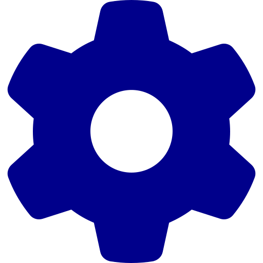
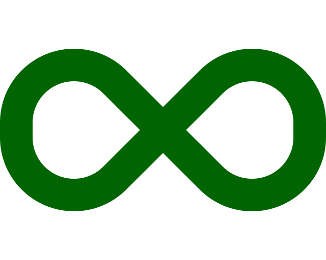

[.basics.background]
= C'est l'heure du choix
:includedir: ../partials

[NOTE.speaker]
====
include::{includedir}/story.adoc[tag=choice]

On va vous proposer trois possibilités qui ne sont pas exhaustives !
====

[.separation.background]
== !

[NOTE.speaker]
====
include::{includedir}/story.adoc[tag=monde-avant]
====

[.separation.background]
== Séparation des responsabiilté

[.step, .ci]
* Construction
[.ci]
* Assemblage
[.cd]
* Mise en service
* Règles

[NOTE.speaker]
====
include::{includedir}/story.adoc[tag=separation]
====

[.separation.background]
== !

[NOTE.speaker]
====
include::{includedir}/story.adoc[tag=structure]
====

[.mediation.background]
== !

[NOTE.speaker]
====
include::{includedir}/story.adoc[tag=mediation]
====

[.mediation.background]
== Et pourquoi pas...

[NOTE.speaker]
====
include::{includedir}/story.adoc[tag=transverse]
====

[.union.background]
== !

[NOTE.speaker]
====
include::{includedir}/story.adoc[tag=union]
====

[.union.background]
== Aller plus loin ...

[NOTE.speaker]
====
include::{includedir}/story.adoc[tag=craft]
====

[.transition.background, transition="slide-in zoom-out"]
== !

[NOTE.speaker]
====
====
