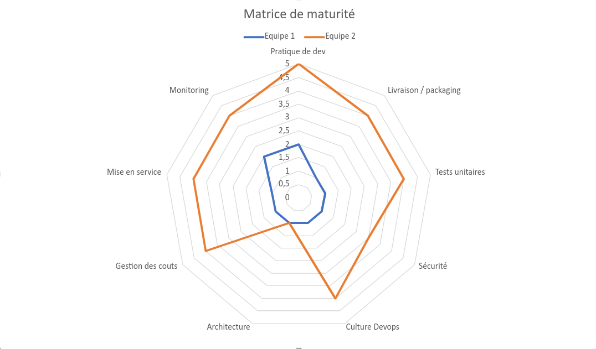

[.basics.background]
= C'est l'heure du choix
:includedir: ../partials

[NOTE.speaker]
====
**Nico  [45 min] **:

* On va donc devoir faire un choix
* On va vous proposer trois possibilités qui ne sont pas exhaustives !

"
include::{includedir}/story.adoc[tag=choice]
"

====

[.separation.background]
== !

image:../images/choix/bolt-solid.svg[ci, 25%]

image:../images/choix/gear-solid.svg[cd, 30%]

[NOTE.speaker]
====
Nico :

* CI et CD se sépare

"
include::{includedir}/story.adoc[tag=monde-avant]
"
====

[.separation.background]
== Séparation des responsabilités

[.step]
* image:../images/choix/bolt-solid.svg[ci, 4%] Construction
* image:../images/choix/bolt-solid.svg[ci, 4%] Assemblage
* image:../images/choix/gear-solid.svg[ci, 5%] Mise en service
* image:../images/choix/gear-solid.svg[ci, 5%] Règles

[NOTE.speaker]
====
Nico :

"
include::{includedir}/story.adoc[tag=separation]
"
====

[.separation.background]
== !

image:../images/choix/bolt-solid.svg[ci, 25%]

image:../images/choix/gear-solid.svg[cd, 30%]

[NOTE.speaker]
====
Nico :
"
include::{includedir}/story.adoc[tag=structure]
"
====

[.mediation.background]
== !

image:../images/choix/bolt-solid.svg[ci, 15%]

image:../images/choix/gear-solid.svg[cd, 20%]

image:../images/choix/infinity-solid.svg[cd, 30%]

[NOTE.speaker]
====
Yann :

* On met en place une équipe DevOps
* On rajoute une couche de bordel dans l'organisation
* Choix stratégique d'entreprise
* Malgré ce qu'on a dit avant

"
include::{includedir}/story.adoc[tag=mediation]
"
====

[.mediation.background]
== Et pourquoi pas...

[%step%]
Proposer sans imposer, critiquer sans discréditer
[%step%]
Vecteur de la culture DevOps

[NOTE.speaker]
====
Yann :

"
include::{includedir}/story.adoc[tag=transverse]
"
====

[.union.background]
== !

image:../images/choix/devops.svg[cd]

[NOTE.speaker]
====
Nico :

* Notre choix
* Plus d'équipe DevOps, mais une vraie culture
* Comme imaginez à la base
* Le plus difficile, mais probablement le plus efficace
* L'équipe est composée des devs et des ops
* L'équipe doit avoir toutes les compétences (on parle de l'équipe, pas de vous tout seul)
* Ouverture d'esprit
* CI et CD forme un vrai couple pour faire de jolis pipelines ensemble

"
include::{includedir}/story.adoc[tag=union]
"
====

[.union.background]
== Aller plus loin ...

[NOTE.speaker]
====
Nico :

include::{includedir}/story.adoc[tag=craft]
====

[.mediation.background]
== Warning

[NOTE.speaker]
====
Si vous vous reconnaissez dans tous les examples qu'on a montré, +
si vous envisager appliquer chacun des concepts, ou de nos examples, +
si avez compris que le code est la solution à toutes vos difficultés, +
vous allez avoir un problème...

Repasser par la méthodo de définition, et focalisez vous sur KISS !!!! +
Et comment simlplifier vos processus, sinon, vos pipelines ne seront pas maintenable ! +
Et CI et CD seront vraiment très triste
====