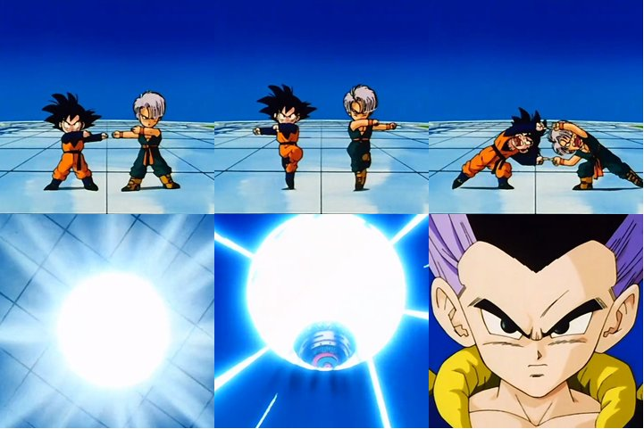

[.code.background]
= L'élément perturbateur
:includedir: ../partials

[NOTE.speaker]
====
**Nico  [17 min] **:

* Lire le texte, il est bien
* Pendant des années, le process CI/CD aussi appelé industrialisation
* Techniquement les deux restaient de leur côté
* Tout se passait bien, même si chacun restait dans son coin
* Beaucoup d'experience, process calé, CI avec ses outils, CD avec les siens
* Pas forcement de besoin de livrer souvent, l'agilité balbutiante
* Des gars dans leur cave, les confs dans les outils
* On sentait qu'un truc manquait malgré tout et leur relation n'était pas très fluide

"
include::{includedir}/story.adoc[tag=all-as-code]
"
====

[.code.background]
== Tous l'admiraient

[NOTE.speaker]
====
Nico :

* Puis la mode du Everything as code
* CI habitué au code, donc hyper content
* CD beaucoup moins (surtout sur les concepts, la maintenabilité, les bonnes pratiques, etc.)

"
include::{includedir}/story.adoc[tag=all-as-code-everything]
"
====

[.code.background]
== Gestion des sources

[source,bash]
----
.angular
.idea
conf
dist
aws
build
docker
docs
node_modules
proxy-backend
src
.browserslistrc
.dockerignore
.editorconfig
.eslintrc.json
.gitignore
.prettierrc
angular.json
CHANGELOG.md
Dockerfile
docker-compose.yml
karma.conf.js
package.json
package-lock.json
README.md
tsconfig.app.json
tsconfig.json
tsconfig.spec.json
Jenkinsfile
launch.bat
site.yml

----

[NOTE.speaker]
====
Nico :

* On a TOUT mis dans les sources de nos projets +
Donc CI avait la main sur tout +
CD était un peu perdu
* Discussions/Disputes de couple =>

"
include::{includedir}/story.adoc[tag=all-as-code-result]
"
====

[.code.background]
== C'est le bordel

[NOTE.speaker]
====
Nico :

"
include::{includedir}/story.adoc[tag=all-as-code-mess]
"
====

[.code.background]
== C'est le bordel

[source,bash]
----
.idea
api
docs
ihm
 | .angular
 | conf
 | src
 | .browserslistrc
 | .dockerignore
 | .editorconfig
 | .eslintrc.json
 | .prettierrc
 | angular.json
 | Dockerfile
 | karma.conf.js
 | package.json
 | package-lock.json
 | tsconfig.app.json
 | tsconfig.json
 | tsconfig.spec.json
infra
.gitattributes
.gitignore
.gitlab-ci.yml
docker-compose.yml
README.md
----

[NOTE.speaker]
====
Nico :

Alors après il y a des solutions pour que chacun reste chez soi, +
mais c'est ce qui va éviter des disputes, +
pas forcément résoudre les dissonances.

====

[.code.background]
== Fusionner les deux process

[NOTE.speaker]
====
Yann :

* On se retrouve avec les fichiers de conf de CI et CD au même endroit
* Il faut donc "merger","fusionner" les fichiers de conf et les pratiques au même endroit
* Avant c'était dans des outils/repertoires/dépots différents
* Avec chacun ces pratiques, habitudes
* Alignement sur le système de branching git pour la CD
* Risques d'échec important, embrouilles
* les décisions de l'équipe de dev, côté CI, qui étaient autonome, on maintenant un impact sur CD
* CD doit s'inscrire dans les habitudes de travail de CI

"
include::{includedir}/story.adoc[tag=all-as-code-end]
"
====

[.basics.background, transition="slide-in zoom-out"]
== Comment aider notre petite famille ?

[NOTE.speaker]
====
Yann :
Il est temps ...

Alors tant qu'on est en pause, on voudrait juste vous prévenir.

Ce que nous allons vous présenter, ce sont des observations que nous avons faites,
des idées que nous avons, et souvent des mises en application qui nous apporte chaque jour.

Quoi qu'il en soit, ce n'est pas une recette magique qui marche à tous les coups,
mais plus une approche pour l'implémentation des pipelines (oui, on va parler de code) qui, on l'espère, va vous aider.
====

