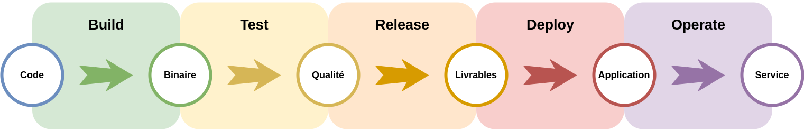

[.ci-cd.background]
= Les petits pipelines
:includedir: ../partials

[NOTE.speaker]
====
**Nico  [7 min] **:

Naissance des pipelines
Beaucoup de tentative pour faire fonctionner ce joli couple CI/CD
Des experiences, des théories, des tests, etc..

"
include::{includedir}/story.adoc[tag=pipelines]
"
====

[.ci-cd.background]
== La définition d'un pipeline

[NOTE.speaker]
====
Nico :

Prenons un peu de hauteur
De manière générale, on arrive à ce type de pipeline (ref schéma)
que tout le monde connait
INCROYABLE, c'est le merge parfait de CI et CD
Attention, ce n'est pas du code

"
include::{includedir}/story.adoc[tag=theories-workflow]
"
====

[.ci-cd.background]
== C'est un dessin...

image::flowchart-draw.png[Dessin, 60%]

[NOTE.speaker]
====
Nico :

* Un pipeline, c'est un DESSIN
* Représente les actions/taches pour aboutir à un process qui part du code et qui va en prod.
* Vu la quantité de taches de CI et CD, c'est indispensable

"
include::{includedir}/story.adoc[tag=theories-dessins]
"
====

[.ci-cd.background]
== ... Et des personnes

image::pipeline-people.png[Personnes, 80%]

[NOTE.speaker]
====
Yann :

* Mais attention, c'est aussi des personnes
* Autant côté dev que ops, le process CI/CD impacte beaucoup plus de monde que les équipes de réal.
* Market', Direction, Dev, Ops, Designers, Agiliste, etc.
* Pour mettre tout le monde d'accord
* mais comme tout le monde à toujours raison dans ce milieu
* on vous propose une méthode pour vous aider à définir ce pipeline pour que notre couple CI/CD aille bien
* Tiré de nos experiences respectives

"
include::{includedir}/story.adoc[tag=theories-atelier]
"
====

[.ci-cd.background]
== Dis, comment on fait des pipelines ?

footnote:eventstorm[https://pablopernot.fr/2019/07/event-storming-description/]

[NOTE.speaker]
====
Nico :
include::{includedir}/story.adoc[tag=theories-eventstorming]
====

[.ci-cd.background, transition="slide-in none-out"]
== !

image::pipeline-steps-1.png[step 1]

[NOTE.speaker]
====
Yann :

* Par où on commence pour définir un pipeline ?
* Par les objectifs.
* D'où l'importance d'avoir tout le monde autour de la table

"
include::{includedir}/story.adoc[tag=pipeline-objectifs]
"
====

[.ci-cd.background, transition=none]
== !

image::pipeline-steps-2.png[step 1]

[NOTE.speaker]
====
Yann :

* Un point très important
* Il faut analyser les process existants de l'entreprise/équipes si ils existent
* Sinon risque de rejet des équipes
* Des réponses existent déjà dans les process
* Si trop de divergence, il faudra p-e faire des compris

"
include::{includedir}/story.adoc[tag=pipeline-process]
"
====

[.ci-cd.background, transition=none]
== !

image::pipeline-steps-3.png[step 1]

[NOTE.speaker]
====
Yann :

* Lors des échanges autour du process, il faut bien identifier les étapes clés
* Ne pas les ranger dans un coin
* Donnerons probablement lieu à des étapes spécifiques dans le pipeline

"
include::{includedir}/story.adoc[tag=pipeline-steps]
"
====

[.ci-cd.background, transition=none]
== !

image::pipeline-steps-4.png[step 1]

[NOTE.speaker]
====
Yann :

* Comme dit précedement, il y a beaucoup de personne qui gravite autour des pipelines
* Qui doit voir quoi, quand et avec quel granularité ?
* Equipe dev, equipe ops, CP, Agiliste, Big boss, Testeur, etc. pas les mêmes besoins de retour => Prendre des exemples
* Attention si besoin d'intégration aux outils existants (board de direction par exemple, JIRA ...)
* Faire simple, c'est compliqué

"
include::{includedir}/story.adoc[tag=pipeline-feedback]
"
====

[.ci-cd.background, transition=none]
== !

image::pipeline-steps-5.png[step 1]

[NOTE.speaker]
====
Yann :

* Les premières prises de décision difficile
* Conflits CI/CD, CI veut tout automatiser, CD veut garder le contrôle
* D'où l'importance des étapes clés, feedback, etc.
* Tout auto n'est pas forcement le mieux
* Surtout si process complexe, et silotage important
* Définition des déclencheurs, humain ou auto
* Debrayage => on verra après

"
include::{includedir}/story.adoc[tag=pipeline-auto]
"
====

[.ci-cd.background, transition=none]
== !

image::pipeline-steps-6.png[step 1]

[NOTE.speaker]
====
Yann :

* On y arrive
* Le choix des outils "ENFIN"
* Ils doivent répondrent aux besoins de feedback, déclenchement, etc.
* Un seul pour tous ? Les meilleurs de chaque de domaine ?
* Côté CI, c'est plus facile car indépendant du reste de l'entreprise
* Côté CD, c'est toujours dépendant de l'infra de la boite, des stacks etc.
* Grosse divergence

"
include::{includedir}/story.adoc[tag=pipeline-outils]
"
====

[.ci-cd.background, transition=none]
== !

image::pipeline-steps-6-warning.png[step 1]

[NOTE.speaker]
====
Nico :
include::{includedir}/story.adoc[tag=pipeline-outils-warn]
====

[.ci-cd.background, transition=none]
== !

image::pipeline-steps-7.png[step 1]

[NOTE.speaker]
====
Yann :
include::{includedir}/story.adoc[tag=pipeline-implem]
====

[.ci-cd.background]
== Et voilà !

image::faire-part.png[step 1, 75%]

[NOTE.speaker]
====
Nico :
include::{includedir}/story.adoc[tag=responsability-start]
====

[.ci-cd.background]
== !

include::{includedir}/story.adoc[tag=responsability-citation]

[NOTE.speaker]
====
Nico :
include::{includedir}/story.adoc[tag=responsability-complexe]
====

[.transition.background, transition="slide-in zoom-out"]
== !

[NOTE.speaker]
====
====
