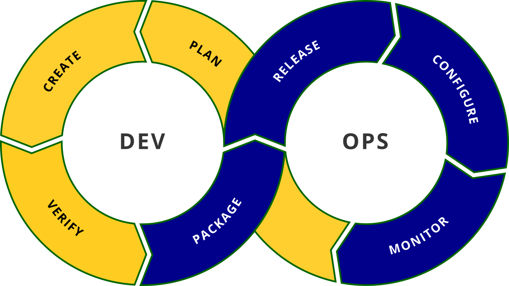

[.devops.background]
= Un plan à trois
:includedir: ../partials

[NOTE.speaker]
====
**Yann  [40 min] **:

* On a vu CI, et fait la rencontre de CD
* Un troisième larron est arrivé : DevOps
* Pour gérer tout ce chantier et "accompagner" CI/CD dans leur vie de couple

"
include::{includedir}/story.adoc[tag=a-trois]
"
====

[.devops.background]
== L'arrivée...

[NOTE.speaker]
====
Yann :

* Il est arrivé parce que ça commençait à être compliqué
* Vu que tout était dans le code, CI a voulu tout faire
* Sans comprendre entièrement les enjeux de CD, ou savoir comment faire
* C'est comme ça qu'est arrivé la culture DevOps, pour gérer la relation CI/CD

"
include::{includedir}/story.adoc[tag=devops]
"
====

[.devops.background]
== La boucle est bouclée

[NOTE.speaker]
====
Yann :

* Mais même si le pipeline allait jusqu'au déploiement
* On ne savait pas ce qu'il se passait après la fin du pipeline
* On a donc rajouté Monitor (qui n'est pas que du monitoring de plateforme, il permet aussi de vérifier que le deploiement soit OK)
* Et plan, pour intégrer les évolutions en fonction de monitor
* Et BIM, la boucle est bouclée
* Génial d'un point de vue market'

"
include::{includedir}/story.adoc[tag=infinite]
"
====

[.devops.background]
== L'émergence

image::../images/puzzle.png[width=50%]

[NOTE.speaker]
====
Nico :

* La culture DevOps demande des compétences transverses
* Prendre en compte les besoins de chacun (Build, qualité pour CI, deliver, deployment pour CD)
* Adosser le fonctionnement/outils de l'entreprise au process
* Donc emergence des équipes DevOps
* Lien entre la CI (les devs) et la CD (les ops)

"
include::{includedir}/story.adoc[tag=team]
"
====

[.devops.background]
== Une question de communication

[NOTE.speaker]
====
Nico :

* Sauf que souvent, au lieu d'avoir une équipe qui cherche à favoriser la comm' dev et ops
* On a une équipe qui se positionne au milieu au lieu d'améliorer l'échange
* On se retrouve donc avec une nouvelle équipe qui doit comprendre et le dev, et l'ops
* Et DevOps est souvent plus proche de CI, de nouveaux problèmes de communication arrivent avec CD.
* Et vu que DevOps, n'est pas CI non plus, il y a donc des problèmes de comm' avec CI

"
include::{includedir}/story.adoc[tag=communication]
"
====

[.devops.background]
== Bref...

[NOTE.speaker]
====
Nico :

* C'est bien de théoriser un nouveau concept, mais ça n'a jamais fluidifié les échanges entre les équipes
* L'ajout d'une équipe DevOps n'aura pas le même impact en fonction des couples CI/CD auprès duquel elle intervient

"
include::{includedir}/story.adoc[tag=mediateur]
"
====

[.transition.background, transition="slide-in zoom-out"]
== !

[NOTE.speaker]
====
Yann :

On arrive donc à la fin de notre exposé

* Méthodo de conception
* Les éléments problématiques
* Quelques solutions issues du dev
* La mouvance DevOps

====
