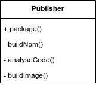
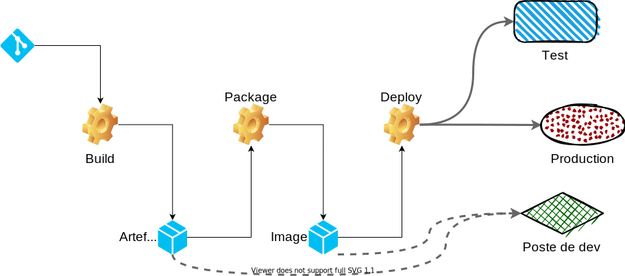

[.ci-cd.background]
= La thérapie de couple
:includedir: ../partials
:figure-caption!:

[NOTE.speaker]
====
**Nico  [20 min] **:

* Côté CI, on sais gérer du code, le maintenir +
Côté CI, se tromper, c'est notre quotidien, défaire, refaire etc.
* Côté CD, on sais anticiper l'imprévisible, réagir vite aux incidents +
Côté CD, bah, non en fait

=> P2

"
include::{includedir}/story.adoc[tag=therapie]
"
====

[.ci-cd.background]
== DRY...

_Don't Repeat Yourself_

[NOTE.speaker]
====
Nico :

* TOPO sur le DRY
* Mais besoin de standardisation sur les pipelines

"
include::{includedir}/story.adoc[tag=dry]
"
====

[.ci-cd.background]
== Exemple

[cols=2]
|===
a|
[source,yaml]
----
deliver_npm_package:
  script:
    - ./is_it_friday.sh
    - npm publish # Livraison NPM
    - ./alert_ops_team.sh
    - ./send_an_email_to_PO.sh

deliver_app:
  script:
    - ./is_it_friday.sh
    - ftp -u myapp.tar.gz # Livraison FTP
    - ./alert_ops_team.sh
    - ./send_an_email_to_PO.sh
----
a|
[source,yaml]
----
.deliver:
  before_script:
    - ./is_it_friday.sh
  after_script:
    - ./alert_ops_team.sh
    - ./send_an_email_to_PO.sh

deliver_npm_package:
  extends: .deliver
  script:
    - npm publish  # Livraison NPM

deliver_app:
  extends: .deliver
  script:
    - ftp -u myapp.tar.gz # Livraison FTP
----

|===

[NOTE.speaker]
====
Yann :

Dans l'exemple suivant :

Dans notre cas, on a une routine pour les déploiements

* est-ce qu'on est vendredi ?
* On livre => le script qui va bien
* on prévient les ops (mail, notif, etc.)
* on prévient le po de la livraison

Ici on peut factoriser grace aux outils fournis par la CI

* gitlab-ci avec after et before script

L'interet de pouvoir réutiliser la routine pour plsuieurs type de déploiement.

L'autre avantage est de bien faire la distinction entre le déploiement en tant que tel et ce qui tourne autour.

====

[.ci-cd.background]
== Exemple

[cols=2]
|===
a|
[source,yaml]
.top-jobs.yaml
----
.deliver:
  variables:
    DELIVER_TASK: ''
  script:
    - ./is_it_friday.sh
    - $DELIVER_TASK
    - ./alert_ops_team.sh
    - ./send_an_email_to_PO.sh

----
a|
[source,yaml]
.gitlab-ci.yml
----

include:
  - project: 'devops-team/tools'
    file: 'top-jobs.yaml'

deliver_npm_package:
  extends: .deliver
  script:
    - npm publish

deliver_app:
  extends: .deliver
  script:
    - ftp -u myapp.tar.gz
----
|===
[NOTE.speaker]
====
Yann :
On voit ici une autre façon de factoriser :
* Soit on passe par des variables => comme des paramètres de fonction

Mais en plus, en sortant le template dans un autre fichier : on peut aller plus loin à en globalisant entre projets !
====

[.ci-cd.background]
== ...mais pas trop !

[NOTE.speaker]
====
Nico :

* Attention à trop de factorisation
* Même défaut que dans le code, impact plus important
* CD aime pas trop ça
* On va voir ce qu'on peut faire

"
include::{includedir}/story.adoc[tag=dry-do]
"
====

[.ci-cd.background]
== Un couple SOLID ?

image:../images/guylookingatgirl.png[]

[NOTE.speaker]
====
Yann :

* Dans le monde du dev, nous avons la conception SOLID, alors la question se pose
* Est-ce que l'on peut appliquer les principes SOLID à notre couple CI/CD et leur petits pipelines ?

On peut se poser la question ...
====

[.ci-cd.background]
== Une responsabilité unique

_**S**OLID (Single responsibility)_

[NOTE.speaker]
====
Nico :

* Commençons par le S de Solid

"
include::{includedir}/story.adoc[tag=solid-s]
"
====

[.ci-cd.background]
== Exemple

[cols="1,1",grid=none]
|===
a|[source,yaml]
----
package:
  image: node
  before_script:
    - # install my tools :-D
  script:
    - npm run build
    - sonar-scanner ...
    - docker build
----
|

a|[source,yaml]
----
build:
  image: node
  script:
    - npm ...

analyse:
  image : sonar-scanner
  script:
    - sonar-scanner ...

publish:
  image: gcr.io/kaniko-project/executor:debug
  script:
    - /kaniko/executor ...

----

|

|===

[NOTE.speaker]
====
Yann:

Dans ce premier exemple, on voit que les étapes pour pouvoir packager passe par le build, le scanner de qualité et finalement le build de l'image docker
Dans le cas présent, gitlab-ci, une image docker, nécessité d'installé tout les outils pour toutes les étapes.

Complexe, difficilement maintenable et pas modulable

Donc, on va faire plusieurs jobs, plusieurs stages, image spécifique avec les outils déjà présent.

(on peut faire pareil avec jenkins :))

====

[.ci-cd.background]
== Exemple

[cols="1,1",grid=none]
|===
a|[source,yaml]
----
deploy:
  script:
    - deploy-db.sh
    - deploy-app.sh
    - deploy-doc.sh
----
|
image:../images/solid/single-respo-bad.png[]
a|[source,yaml]
----
deploy_doc:
  ...

deploy_app:
  ...

deploy_db:
  ...
----

|
image:../images/solid/single-respo-good.png[]
|===

[NOTE.speaker]
====
Yann :

Ici, on va préférer avec des jobs différents pour les différents types d'élément à déployer. Ce sera plus simple à maintenir dans le temps, et ce n'est tout simplement pas la même chose. De plus, de cette façon, vous pourrez plus facilement réutiliser vos jobs.

Ca peut paraitre bête dit comme ça, mais on voit souvent le build ou le deploiement dans les mêmes jobs, autant en faire plusieurs et les paralléliser
====

[.ci-cd.background]
== Rester ouvert...
_S**O**LID (Open/Closed principle)_

[NOTE.speaker]
====
Nico:

* Continuons avec le O, Open Closed Principles, probablement le principe le plus maltraité dans les pipelines
* Fermé sur sa responsabilité
* Ouvert à la configuration

"
include::{includedir}/story.adoc[tag=solid-o]
"
====

[.ci-cd.background]
== Exemple

[cols=3, grid=none]
|===
2+a|[source,yaml]
----
.bad-sonar:
  variables:
    PROJECT_KEY: ''
  script:
    - \|
        sonar-scanner -Dsonar.projectKey=$PROJECT_KEY
        -Dsonar.sources=./src
        -Dsonar.tests=tests/
----

|image:../images/solid/open-closed-bad.png[]
2+a|
[source,yaml]
----
.good-sonar:
  variables:
    PROJECT_KEY: ''
    SONAR_EXTRA_PARAMETERS: ''
  script:
    - sonar-scanner -Dsonar.projectKey=$PROJECT_KEY \
      -Dproject.settings=./sonar-project.properties \
      $SONAR_EXTRA_PARAMETERS
----
|
image:../images/solid/open-closed-good.png[]
|===

[NOTE.speaker]
====
Yann :

Nous trouvons ici un template de job permettant de faire une analyse sonar. On peut voir dans le premier cas, que si on veut ajouter des nouveaux paramètres à Sonar, il va falloir modifier la ligne de commande ou la surcharger complètement.

Dans le deuxième, le template nous propose deux manières d'étendre le job, on peut passer par le fichier de configuration de sonar ou ajouter directement des paramètres à la ligne de commande via les variables.

On conserve donc le fait que l'on exige la définition du project_key mais le reste de configuration est complètement modifiable.
====

[.ci-cd.background]
== Liskov à la rescousse...

_SO**L**ID (Liskov substitution)_ ...ou pas !

image:../images/barbara_liskov.png["Barbara Liskov", 50%]footnote:liskovz[Barbara Liskov]

[NOTE.speaker]
====
Nico :

- Le L de SOLID, La subsitution de Liskov
- Dites bonjour à Barbara (c'est vraiment elle sur la photo qui a théorisé cette principe)

"
include::{includedir}/story.adoc[tag=solid-l]
"
====

[.ci-cd.background]
== Ségrégation d'interface

_SOL**I**D (Interface segregation)_

[NOTE.speaker]
====
Nico :

- I comme Interface Segregation

"
include::{includedir}/story.adoc[tag=solid-i]
====

[.ci-cd.background]
== Exemple

[cols=3, grid=none]
|===
2+a|
.template.yaml
[source,yaml]
----
build:            #Assemble le Jar
  stage: build
analyse-code:     #Faire les analyses qualité
  stage: test
analyse-package:  #Faire les analyses qualité
  stage: test
package:          #Construire l'image Docker
  stage: package
can-i-deploy:     #Faire les analyses qualité
  stage: test
deploy:           #Déploie dans l'infra
  stage: deploy
----
|image:../images/solid/interface-segragation-bad.png[]
2+a|
.maven-template.yaml
[source,yaml]
----
build:            #Assemble le Jar
    ...
analyse-build:    #Faire les analyses qualité
    ...
----

.docker-template.yaml
[source,yaml]
----
analyse-package:  #Faire les analyses qualité
    ...
package:          #Construire l'image Docker
    ...
----

.terrform-template.yaml
[source,yaml]
----
can-i-deploy:     #Faire les analyses qualité
    ...
deploy:           #Déploie dans l'infra
    ...
----
|image:../images/solid/interface-segragation-good.png[]
|===

[NOTE.speaker]
====
Yann :

Dans l'exemple suivant :

* pipeline/template de pipeline unique pour tout le monde
* Dans l'idée c'est bien
* Mais problèmatique si on a des besoins différents, exemple application vs librairie
* Segregation d'interface : on va faire des templates par besoin puis potentiellement avec des templates qui rassemble d'autres templates
====

[.ci-cd.background]
== Une inversion de dépendance ?

_SOLI**D** (Dependency inversion)_

[NOTE.speaker]
====
Nico :

* Et pour finir, l'inversion de dépendance
* Qui va faire plaisir à CD surtout

"
include::{includedir}/story.adoc[tag=solid-d]
"
====

[.ci-cd.background]
== Exemple

[cols=3, grid=none]
|===
2+a|
[source,yaml]
----
deliver-on-artifactory:
  script: ./push_artefact_to_repo.sh

deploy: # Attend que l'étape de livraison soit ok
  needs: [deliver-on-artifactory]
  script: ./deploy.sh
----
|image:../images/solid/dependency-inversion-bad.png[]
2+a|
[source,yaml]
----
# Doit déposer l'artefact au bon endroit
deliver:
  script: ./push_artefact_to_repo.sh

# Vérifie que l'artefact soit bien présent
check_artefact_readiness:
  script: ./check_artefact.sh

# Déploie si l'artefact est au bon endroit
# (contrat respecté)
deploy:
  needs: [check_artefact_readiness]
  script: ./deploy.sh
----
|image:../images/solid/dependency-inversion-good.png[]
|===
[NOTE.speaker]
====
Yann :
Dans notre premier cas, le job deploy est dépendant de l'execution de deliver, ce qui est assez classique.

Mais pour rendre le job indépendant, on peut très bien définir un job "de contrôle" (une interface) qui va vérifier que l'artefact doit être bien présent au bon endroit avant de lancer le déploiement. Ainsi, c'est le job deliver (ou un job de transition ou "un adapter par exemple") qui doit "respecter" les règles imposées par le job deploy. Ce qui rend mécaniquement les jobs indépendants l'un de l'autre.
====

[.ci-cd.background]
== Un peu de lacher prise ?

_Le risque du "tout automatique"_

[NOTE.speaker]
====
Nico :

* Comme dit precedement, CI et CD ont des divergences, des complémentarités et surtout un même objectif
* Même si on arrive à construire un pipeline qui convienne à CI et CD
* Et malgré tout ces principes SOLID, on a toujours un problème
* Si le pipeline va de bout en bout, même si on fait attention, si le moindre grain de sable se met dans les rouages, ça va pété

"
include::{includedir}/story.adoc[tag=lacher]
"
====

[.ci-cd.background]
== Exemple

[cols=2]
|===
a|
[source,json]
.Jenkinsfile.build
----
{
  ...,
  stage ('deliver') {
    build '../proj-deliver/master'
  }
}
----
[source,json]
.Jenkinsfile.deliver
----
{
  stage('check requirements') {}
  stage('Deploy approval') {
    input "Deploy to prod ?"
  }
  stage ('deploy') {
    build '../proj-deliver/master'
  }
}
----

[source,json]
.Jenkinsfile.deploy
----
{
  stage('check requirements') {}
  ...,
}
----
a|
image::../images/solid/debrayable.png[]
|===

[NOTE.speaker]
====
Yann :
Ici, on voit deux façons d'intervenir pendant le déroulement d'un pipeline, on peut faire des pipelines différents qui se déclenchent les uns les autres :ce qui nous permet de déclencher soit toutes les actions, soit lancer les pipelines à différentes étapes. Et une autre possibilité, c'est de mettre des points d'arrêt dans les pipelines permettant d'attendre une action manuelle avant de continuer.
====

[.ci-cd.background]
== Pouvoir debrayer !

_Ou l'art de faire des pauses_

[NOTE.speaker]
====
Nico :

* Il faut donc pouvoir debrayer
* Mettre des points d'arrêt
* L'importance de l'inversion de dépendance
* Gain en lisibilité, surtout sur les points d'arrêt défini lors des ateliers de création des pipelines
* Pouvoir reprendre/relancer

"
include::{includedir}/story.adoc[tag=debrayage]
"
====

[.ci-cd.background]
== Points d'inférence

[NOTE.speaker]
====
Yann :

* Si on envoie le résultat en directe à l'étape d'après :
** On ne peut pas tester
** On ne peut pas débrayer manuellement la tache précédente
* Si un élément est en échec
** On ne peut pas le relancer sans relancer l'intégralité
** On ne peut pas tester / valider (voir utiliser) les résultats intermédiaires
====

[.ci-cd.background]
== Oups ...

image::../images/complexite.png[]

[NOTE.speaker]
====
Nico :

* Bon ok, c'est devenu vraiment le bordel là
* C'est normal, mieux connu par le monde CI (le monde de dev) que CD
* Petit point sur la complexité

"
include::{includedir}/story.adoc[tag=accidentelle]
"
====

[.ci-cd.background]
== Le monde des Bisounours

image::../images/bisounours.png[]

[%step%]
KISS : Keep It Simple Stupid

[NOTE.speaker]
====
Nico :

* Mais il reste un dernier principe : KISS
* Bon, on vous a présenté quelques principes et concepts
* pour vous aider à implementer le pipeline : ref deuxième partie de la prez
* pour faire plaisir et aider le couple CI/CD
* Si vous n'avez pas besoin de tout ça, ne le faite pas
* Restez simple

"
include::{includedir}/story.adoc[tag=kiss]
"
====

[.basics.background, transition="slide-in zoom-out"]
== Qui est ce thérapeute ?

[NOTE.speaker]
====
Yann :

* La Difficulté pour faire des pipelines s'est accrue
* Comprehension technique globale de CI CD
* Ce n'est ni du dev ni de l'ops, mais un peu des deux
* Donc comment faire ?
====
