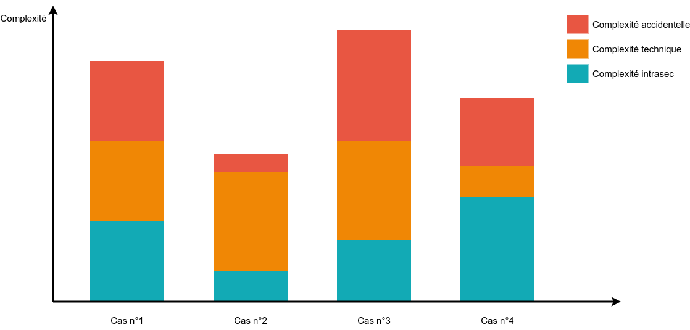

[.ci-cd.background]
= La thérapie de couple
:includedir: ../partials
:figure-caption!:

[NOTE.speaker]
====
**Nico  [20 min] **:

* Côté CI, on sais gérer du code, le maintenir
* Côté CD, on sais anticiper l'imprévisible, réagir vite aux incidents

* Côté CI, se tromper, c'est notre quotidien, défaire, refaire etc.
* Côté CD, bah, non en fait

* Comme nous sommes plus d'origine CI, on va filer quelques conseils à CD, autrement dit : la belle famille

* Vu que maintenant tout le pipeline est écrit en code (et dans les sources d'autant plus)

"
include::{includedir}/story.adoc[tag=therapie]
"
====

[.ci-cd.background]
== DRY...

[NOTE.speaker]
====
Nico :

* TOPO sur le DRY
* Mais besoin de standardisation sur les pipelines

"
include::{includedir}/story.adoc[tag=dry]
"
====

[.ci-cd.background]
== Exemple

[cols=2]
|===
a|
[source,yaml]
----
.deliver:
  variables:
    DELIVER_TASK: ''
  script:
    - ./is_it_friday.sh
    - $DELIVER_TASK
    - ./alert_ops_team.sh
    - ./send_an_email_to_PO.sh

deliver_npm_package:
  extends: .deliver
  variables:
    DELIVER_TASK: npm publish

deliver_app:
  extends: .deliver
  variables:
    DELIVER_TASK: ftp -u myapp.tar.gz
----
a|
[source,yaml]
----
.deliver:
  variables:
    DELIVER_TASK: ''
  before_script:
    - ./is_it_friday.sh
  after_script:
    - ./alert_ops_team.sh
    - ./send_an_email_to_PO.sh

deliver_npm_package:
  extends: .deliver
  script:
    - npm publish

deliver_app:
  extends: .deliver
  script:
    - ftp -u myapp.tar.gz
----
|===
[NOTE.speaker]
====
Yann :

Dans l'exemple suivant :

Dans notre cas, on a une routine pour les déploiements

* est-ce qu'on est vendredi ?
* On livre => le script qui va bien
* on prévient les ops (mail, notif, etc.)
* on prévient le po de la livraison

Deux façons de factoriser différentes

* Soit on passe par des variables => comme des paramètres de fonction
* Soit on s'appuie sur l'outillage => gitlab-ci avec after et before script

L'interet de pouvoir réutiliser la routine pour plsuieurs type de déploiement.

L'autre avantage est de bien faire la distinction entre le déploiement en tant que tel et ce qui tourne autour.

====

[.ci-cd.background]
== ...mais pas trop !

[NOTE.speaker]
====
Nico :

* Attention à trop de factorisation
* Même défaut que dans le code, impact plus important
* CD aime pas trop ça
* On va voir ce qu'on peut faire

"
include::{includedir}/story.adoc[tag=dry-do]
"
====

[.ci-cd.background]
== Un couple SOLID ?

image:../images/guylookingatgirl.png[]

[NOTE.speaker]
====
Nico :

* Dans le monde du dev, nous avons la conception SOLID, alors la question se pose
* Est-ce que l'on peut appliquer les principes SOLID à notre couple CI/CD et leur petits pipelines ?

On peut se poser la question ...
====

[.ci-cd.background]
== Une responsabilité unique

[NOTE.speaker]
====
Nico :

* Commençons par le S de Solid

"
include::{includedir}/story.adoc[tag=solid-s]
"
====

[.ci-cd.background]
== Exemple

[cols="1,1",grid=none]
|===
a|[source,yaml]
----
deploy:
  script:
    - if [ -n $IS_PHP_PROJECT]; then vendor/bin/phpcs src; fi
    - if [ -f Dockerfile ]; hadolint Dockerfile; fi
    - sonar-scanner ...

----
|
image:../images/solid/single-respo-bad.png[]
2+^|VS
a|[source,yaml]
----
deploy_doc:
  ...

deploy_app:
  ...

deploy_db:
  ...
----

|
image:../images/solid/single-respo-good.png[]
|===

[NOTE.speaker]
====
Ici, on va préférer avec des jobs différents pour les différents types d'élément à déployer. Ce sera plus simple à maintenir dans le temps, et ce n'est tout simplement pas la même chose. De plus, de cette façon, vous pourrez plus facilement réutiliser vos jobs.

Ca peut paraitre bête dit comme ça, mais on voit souvent le build ou le deploiement dans les mêmes jobs, autant en faire plusieurs et les paralléliser
====

[.ci-cd.background]
== Rester ouvert...

Mais pas trop !

[NOTE.speaker]
====
Nico:

* Continuons avec le O, Open Closed Principles, probablement le principe le plus maltraité dans les pipelines

"
include::{includedir}/story.adoc[tag=solid-o]
"
====

[.ci-cd.background]
== Exemple

[cols=3, grid=none]
|===
2+a|[source,yaml]
----
.bad-sonar:
  variables:
    PROJECT_KEY: ''
  script:
    - \|
        sonar-scanner -Dsonar.projectKey=$PROJECT_KEY
        -Dsonar.sources=./src
        -Dsonar.tests=tests/
----

|
3+^|VS
2+a|
[source,yaml]
----
.good-sonar:
  variables:
    PROJECT_KEY: ''
    SONAR_EXTRA_PARAMETERS: ''
  script:
    - sonar-scanner -Dsonar.projectKey=$PROJECT_KEY \
      -Dproject.settings=./sonar-project.properties \
      $SONAR_EXTRA_PARAMETERS
----
|
image:../images/solid/open-closed-good.png[]
|===

[NOTE.speaker]
====
Yann :

Nous trouvons ici un template de job permettant de faire une analyse sonar. On peut voir dans le premier cas, que si on veut ajouter des nouveaux paramètres à Sonar, il va falloir modifier la ligne de commande ou la surcharger complètement.

Dans le deuxième, le template nous propose deux manières d'étendre le job, on peut passer par le fichier de configuration de sonar ou ajouter directement des paramètres à la ligne de commande via les variables.

On conserve donc le fait que l'on exige la définition du project_key mais le reste de configuration est complètement modifiable.
====

[.ci-cd.background]
== Liskov à la rescousse...

.Barbara Liskov

...ou pas !

[NOTE.speaker]
====
Nico :

- Le L de SOLID, La subsitution de Liskov
- Dites bonjour à Barbara (c'est vraiment elle sur la photo qui a théorisé cette principe)

"
include::{includedir}/story.adoc[tag=solid-l]
"
====

[.ci-cd.background]
== Spécialisation

[NOTE.speaker]
====
Nico :

- I comme Interface Segregation

"
include::{includedir}/story.adoc[tag=solid-i]
"
====

[.ci-cd.background]
== Exemple

[cols=3, grid=none]
|===
2+a|
[source,yaml]
----
.analyse_code: # Le truc fait toutes les analyses
  script:
    - if [ -n $IS_PHP_PROJECT]; then vendor/bin/phpcs src; fi
    - if [ -f Dockerfile ]; hadolint Dockerfile; fi
    - sonar-scanner ...
----
|image:../images/solid/interface-segragation-bad.png[]
3+^|VS
2+a|
[source,yaml]
----

.php_lint:
  script:
    - vendor/bin/phpcs src

.hadolint:
  script:
    - hadolint Dockerfile

.sonar_analysis:
  script:
    - sonar-scanner ...
----
|image:../images/solid/interface-segragation-good.png[]
|===

[NOTE.speaker]
====
Yann :

Dans les templates suivants, on voit que le développeur cherche à factoriser l'analyse de code, mais ici, l'"interface" permet de couvrir tous les outils et les technos. L'exemple est un peu grossier, mais on le retrouve de temps en temps.

Il vaut mieux avoir des jobs/templates spécialisés qui permettront d'être réutiliser et/ou débrancher au besoin.
====

[.ci-cd.background]
== Une inversion de contrôle ?

[NOTE.speaker]
====
Nico :

* Et pour finir, l'inversion de dépendance
* Qui va faire plaisir à CD surtout

"
include::{includedir}/story.adoc[tag=solid-d]
"
====

[.ci-cd.background]
== Exemple

[cols=3, grid=none]
|===
2+a|
[source,yaml]
----
deliver-on-artifactory:
  script: ./push_artefact_to_repo.sh

deploy: # Attend que l'étape de livraison soit ok
  needs: [deliver]
  script: ./deploy.sh
----
|
3+^|VS
2+a|
[source,yaml]
----
# Doit déposer l'artefact au bon endroit
deliver:
  script: ./push_artefact_to_repo.sh

# Vérifie que l'artefact soit bien présent
check_artefact_readiness:
  script: ./check_artefact.sh

# Déploie si l'artefact est au bon endroit
# (contrat respecté)
deploy:
  needs: [check_artefact_readiness]
  script: ./deploy.sh
----
|
|===
[NOTE.speaker]
====
Yann :
Dans notre premier cas, le job deploy est dépendant de l'execution de deliver, ce qui est assez classique.

Mais pour rendre le job indépendant, on peut très bien définir un job "de contrôle" (une interface) qui va vérifier que l'artefact doit être bien présent au bon endroit avant de lancer le déploiement. Ainsi, c'est le job deliver (ou un job de transition ou "un adapter par exemple") qui doit "respecter" les règles imposées par le job deploy. Ce qui rend mécaniquement les jobs indépendants l'un de l'autre.
====

[.ci-cd.background]
== Un peu de lacher prise ?

[NOTE.speaker]
====
Nico :

* Comme dit precedement, CI et CD ont des divergences, des complémentarités et surtout un même objectif
* Même si on arrive à construire un pipeline qui convienne à CI et CD
* Et malgré tout ces principes SOLID, on a toujours un problème
* Si le pipeline va de bout en bout, même si on fait attention, si le moindre grain de sable se met dans les rouages, ça va pété

"
include::{includedir}/story.adoc[tag=lacher]
"
====

[.ci-cd.background]
== Pouvoir debrayer !

[NOTE.speaker]
====
Nico :

* Il faut donc pouvoir debrayer
* Mettre des points d'arrêt
* L'importance de l'inversion de dépendance
* Gain en lisibilité, surtout sur les points d'arrêt défini lors des ateliers de création des pipelines
* Pouvoir reprendre/relancer

"
include::{includedir}/story.adoc[tag=debrayage]
"
====

[.ci-cd.background]
== Exemple

[cols=2]
|===
a|
[source,json]
.Jenkinsfile.build
----
{
  ...,
  stage ('deliver') {
    build '../proj-deliver/master'
  }
}
----
[source,json]
.Jenkinsfile.deliver
----
{
  stage('check requirements') {}
  stage('Deploy approval') {
    input "Deploy to prod ?"
  }
  stage ('deploy') {
    build '../proj-deliver/master'
  }
}
----

[source,json]
.Jenkinsfile.deploy
----
{
  stage('check requirements') {}
  ...,
}
----
a|
image::../images/solid/debrayable.png[]
|===

[NOTE.speaker]
====
Yann :
Ici, on voit deux façons d'intervenir pendant le déroulement d'un pipeline, on peut faire des pipelines différents qui se déclenchent les uns les autres :ce qui nous permet de déclencher soit toutes les actions, soit lancer les pipelines à différentes étapes. Et une autre possibilité, c'est de mettre des points d'arrêt dans les pipelines permettant d'attendre une action manuelle avant de continuer.
====

[.ci-cd.background]
== Oups ...

[NOTE.speaker]
====
Nico :

* Bon ok, c'est devenu vraiment le bordel là
* C'est normal, mieux connu par le monde CI (le monde de dev) que CD
* Petit point sur la complexité

"
include::{includedir}/story.adoc[tag=accidentelle]
"
====

[.ci-cd.background]
== Le monde des Bisounours

[NOTE.speaker]
====
Nico :

* Mais il reste un dernier principe : KISS
* Bon, on vous a présenté quelques principes et concepts
* pour vous aider à implementer le pipeline : ref deuxième partie de la prez
* pour faire plaisir et aider le couple CI/CD
* Si vous n'avez pas besoin de tout ça, ne le faite pas
* Restez simple

"
include::{includedir}/story.adoc[tag=kiss]
"
====

[.transition.background, transition="slide-in zoom-out"]
== !

[NOTE.speaker]
====
* Difficulté accrue de faire des pipelines
* Comprehension technique globale de CI CD
* Ce n'est ni du dev ni de l'ops, mais un peu des deux
* Donc comment faire ?
====
