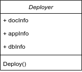
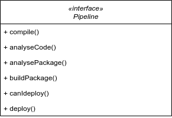

[.ci-cd.background]
= La thérapie de couple
:includedir: ../partials
:figure-caption!:

[NOTE.speaker]
====
include::{includedir}/story.adoc[tag=therapie]
====

[.ci-cd.background]
== DRY...

[NOTE.speaker]
====
include::{includedir}/story.adoc[tag=dry]
====

[.ci-cd.background]
== Exemple

[cols=2]
|===
a|
[source,yaml]
----
.deliver:
  variables:
    DELIVER_TASK: ''
  script:
    - ./is_it_friday.sh
    - $DELIVER_TASK
    - ./alert_ops_team.sh
    - ./send_an_email_to_PO.sh

deliver_npm_package:
  extends: .deliver
  variables:
    DELIVER_TASK: npm publish

deliver_app:
  extends: .deliver
  variables:
    DELIVER_TASK: ftp -u myapp.tar.gz
----
a|
[source,yaml]
----
.deliver:
  variables:
    DELIVER_TASK: ''
  before_script:
    - ./is_it_friday.sh
  after_script:
    - ./alert_ops_team.sh
    - ./send_an_email_to_PO.sh

deliver_npm_package:
  extends: .deliver
  script:
    - npm publish

deliver_app:
  extends: .deliver
  script:
    - ftp -u myapp.tar.gz
----
|===
[NOTE.speaker]
====
include::{includedir}/story.adoc[tag=dry]
====

[.ci-cd.background]
== ...mais pas trop !

[NOTE.speaker]
====
include::{includedir}/story.adoc[tag=dry-do]
====

[.ci-cd.background]
== Un couple SOLID ?

image:../images/guylookingatgirl.png[]

[NOTE.speaker]
====
On peut se poser la question ...
====

[.ci-cd.background]
== Une responsabilité unique

[NOTE.speaker]
====
include::{includedir}/story.adoc[tag=solid-s]
====

[.ci-cd.background]
== Exemple

[cols="1,1",grid=none]
|===
a|[source,yaml]
----
deploy:
  script:
    - if [ -n $IS_PHP_PROJECT]; then vendor/bin/phpcs src; fi
    - if [ -f Dockerfile ]; hadolint Dockerfile; fi
    - sonar-scanner ...

----
|

2+^|VS
a|[source,yaml]
----
deploy_doc:
  ...

deploy_app:
  ...

deploy_db:
  ...
----

|
image:../images/solid/single-respo-good.png[]
|===

[NOTE.speaker]
====
Ici, on va préférer avec des jobs différents pour les différents types d'élément à déployer. Ce sera plus simple à maintenir dans le temps, et ce n'est tout simplement pas la même chose. De plus, de cette façon, vous pourrez plus facilement réutiliser vos jobs.
====

[.ci-cd.background]
== Rester ouvert...

Mais pas trop !

[NOTE.speaker]
====
include::{includedir}/story.adoc[tag=solid-o]
====

[.ci-cd.background]
== Exemple

[cols=3, grid=none]
|===
2+a|[source,yaml]
----
.bad-sonar:
  variables:
    PROJECT_KEY: ''
  script:
    - \|
        sonar-scanner -Dsonar.projectKey=$PROJECT_KEY
        -Dsonar.sources=./src
        -Dsonar.tests=tests/
----

|image:../images/solid/open-closed-bad.png[]
3+^|VS
2+a|
[source,yaml]
----
.good-sonar:
  variables:
    PROJECT_KEY: ''
    SONAR_EXTRA_PARAMETERS: ''
  script:
    - sonar-scanner -Dsonar.projectKey=$PROJECT_KEY \
      -Dproject.settings=./sonar-project.properties \
      $SONAR_EXTRA_PARAMETERS
----
|

|===

[NOTE.speaker]
====
Nous trouvons ici un template de job permettant de faire une analyse sonar. On peut voir dans le premier cas, que si on veut ajouter des nouveaux paramètres à Sonar, il va falloir modifier la ligne de commande ou la surcharger complètement.

Dans le deuxième, le template nous propose deux manières d'étendre le job, on peut passer par le fichier de configuration de sonar ou ajouter directement des paramètres à la ligne de commande via les variables.

On conserve donc le fait que l'on exige la définition du project_key mais le reste de configuration est complètement modifiable.
====

[.ci-cd.background]
== Liskov à la rescousse...

.Barbara Liskov
image::../images/barbara_liskov.png["Barbara Liskov", 75%]

...ou pas !

[NOTE.speaker]
====
include::{includedir}/story.adoc[tag=solid-l]
====

[.ci-cd.background]
== Spécialisation

[NOTE.speaker]
====
include::{includedir}/story.adoc[tag=solid-i]
====

[.ci-cd.background]
== Exemple

[cols=3, grid=none]
|===
2+a|
[source,yaml]
----
.analyse_code: # Le truc fait toutes les analyses
  script:
    - if [ -n $IS_PHP_PROJECT]; then vendor/bin/phpcs src; fi
    - if [ -f Dockerfile ]; hadolint Dockerfile; fi
    - sonar-scanner ...
----
|
3+^|VS
2+a|
[source,yaml]
----

.php_lint:
  script:
    - vendor/bin/phpcs src

.hadolint:
  script:
    - hadolint Dockerfile

.sonar_analysis:
  script:
    - sonar-scanner ...
----
|image:../images/solid/interface-segragation-good.png[]
|===

[NOTE.speaker]
====
Dans les templates suivants, on voit que le développeur cherche à factoriser l'analyse de code, mais ici, l'"interface" permet de couvrir tous les outils et les technos. L'exemple est un peu grossier, mais on le retrouve de temps en temps.

Il vaut mieux avoir des jobs/templates spécialisés qui permettront d'être réutiliser et/ou débrancher au besoin.
====

[.ci-cd.background]
== Une inversion de contrôle ?

[NOTE.speaker]
====
include::{includedir}/story.adoc[tag=solid-d]
====

[.ci-cd.background]
== Exemple

[cols=3, grid=none]
|===
2+a|
[source,yaml]
----
deliver-on-artifactory:
  script: ./push_artefact_to_repo.sh

deploy: # Attend que l'étape de livraison soit ok
  needs: [deliver]
  script: ./deploy.sh
----
|image:../images/solid/dependency-inversion-bad.png[]
3+^|VS
2+a|
[source,yaml]
----
deliver: # Doit déposer l'artefact au bon endroit
  script: ./push_artefact_to_repo.sh

check_artefact_readiness: # Vérifie que l'artefact soit bien présent
  script: ./check_artefact.sh

deploy: # Vérifie que l'artefact soit bien présent
  needs: [check_artefact_readiness]
  script: ./deploy.sh
----
|image:../images/solid/dependency-inversion-good.png[]
|===
[NOTE.speaker]
====
Dans notre premier cas, le job deploy est dépendant de l'execution de deliver, ce qui est assez classique.

Mais pour rendre le job indépendant, on peut très bien définir un job "de contrôle" (une interface) qui va vérifier que l'artefact doit être bien présent au bon endroit avant de lancer le déploiement. Ainsi, c'est le job deliver (ou un job de transition ou "un adapter par exemple") qui doit "respecter" les règles imposées par le job deploy. Ce qui rend mécaniquement les jobs indépendants l'un de l'autre.
====

[.ci-cd.background]
== Un peu de lacher prise ?

[NOTE.speaker]
====
include::{includedir}/story.adoc[tag=lacher]
====

[.ci-cd.background]
== Pouvoir debrayer !

[NOTE.speaker]
====
include::{includedir}/story.adoc[tag=debrayage]
====

[.ci-cd.background]
== Exemple

[cols=2]
|===
a|
[source,json]
.Jenkinsfile.build
----
{
  ...,
  stage ('deliver') {
    build '../proj-deliver/master'
  }
}
----
[source,json]
.Jenkinsfile.deliver
----
{
  stage('check requirements') {}
  stage('Deploy approval') {
    input "Deploy to prod ?"
  }
  stage ('deploy') {
    build '../proj-deliver/master'
  }
}
----

[source,json]
.Jenkinsfile.deploy
----
{
  stage('check requirements') {}
  ...,
}
----
a|
image::../images/solid/debrayable.png[]
|===

[NOTE.speaker]
====
Ici, on voit deux façons d'intervenir pendant le déroulement d'un pipeline, on peut faire des pipelines différents qui se déclenchent les uns les autres :ce qui nous permet de déclencher soit toutes les actions, soit lancer les pipelines à différentes étapes. Et une autre possibilité, c'est de mettre des points d'arrêt dans les pipelines permettant d'attendre une action manuelle avant de continuer.
====

[.ci-cd.background]
== Le monde des Bisounours

image::../images/bisounours.png[]

[NOTE.speaker]
====
include::{includedir}/story.adoc[tag=kiss]
====

[.ci-cd.background]
== Oups ...

[NOTE.speaker]
====
include::{includedir}/story.adoc[tag=accidentelle]
====

[.basics.background, .transition]
== !

[NOTE.speaker]
====
====
