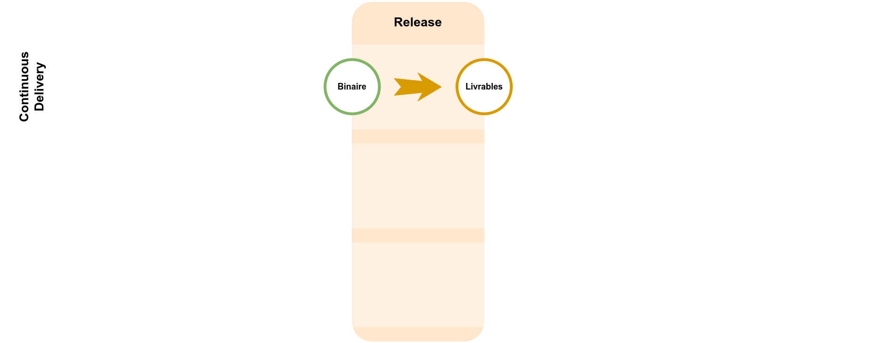
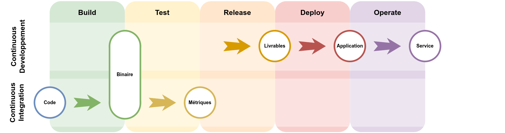

[.basics.background, transition="zoom-in slide-out"]
= Nos deux tourtereaux
:includedir: ../partials

[NOTE.speaker]
====
**Yann [1 min] **:

"
include::{includedir}/story.adoc[tag=tourtereaux]
"
====

[.ci.background]
== CI

[NOTE.speaker]
====
Yann :

* Nous parlons bien évidemment de CI.
* Intégration continue. que tout le monde, normalement, connait

"
include::{includedir}/story.adoc[tag=ci-start]
"
====

[.ci.background, transition="slide-in fade-out"]
== Continuous Build

image::../images/cicd-cicd.build.png[]

[NOTE.speaker]
====
Yann :

* Première chose : build en continue. Pour automatiser, indus. Avec pour objectif de faciliter le build, c'est la naissance de la CI.

* ATTENTION : on ne parle pas encore de pipeline au sens script, on parle pipeline au sens étape

"
include::{includedir}/story.adoc[tag=ci-build]
"
====

[.ci.background, transition="fade-in slide-out"]
== Continuous Integration

image::../images/cicd-cicd.integration.png[]

[NOTE.speaker]
====
Yann :

L'intégration continue, que nous faisons tous aujourd'hui.

"
include::{includedir}/story.adoc[tag=ci-integration]
"
====

[.ci.background]
== Bref...
image::../images/geek-evolution.png[]

[NOTE.speaker]
====
Yann :

* Sur des années, CI a évolué, de plus en plus de technos/d'outils/technique.
* Mais reste dans le contexte du dev.

"
include::{includedir}/story.adoc[tag=ci-end]
"
====

[.cd.background]
== CD

[NOTE.speaker]
====
Nico :

* On vous propose UNE définition
* CD : deployment, delivery, development
* Un truc d'OPS à la base, emmener le code en prod.

"
include::{includedir}/story.adoc[tag=cd-start]
"
====

[.cd.background, transition="slide-in none-out"]
== Delivery

[NOTE.speaker]
====
Nico :

Une fois que CI a fait son job, CD prend le relai.

* Binaire/package => Livrables package deb, tarball, executable windows, etc.
* Code tout seul, ne sert à rien
* On script la créa des livrables facilement

"
include::{includedir}/story.adoc[tag=cd-delivery]
"
====

[.cd.background, transition=none]
== Deployment

image::../images/cicd-cicd.deployment.png[]

[NOTE.speaker]
====
Nico :

Déploiement continue :

* Fait à la main, ou script aidant
* Risque élevé
* De plus en plus fréquent ( => Agilité )
* Dépendant du monde externe

"
include::{includedir}/story.adoc[tag=cd-deployment]
"

====

[.cd.background, transition=none]
== Development

image::../images/cicd-cicd.development.png[]

[NOTE.speaker]
====
Nico :

Développement continue :

* On "opère" un service => le RUN
* Changement de paradigme, on ne fait pas que déployer une appli, on gère un service
* Non automatisé, même si beaucoup d'outils
* Les admin sys

"
include::{includedir}/story.adoc[tag=cd-development]
"
====

[.cd.background]
== Bref...
image::../images/geek-evolution.png[]
[NOTE.speaker]
====
Nico :

* CD fait de tout
* Complexe car beaucoup de facteurs
* automatisation pas forcement evidente/possible
* Haut niveau de risque

"
include::{includedir}/story.adoc[tag=cd-end]
"
====

[.ci-cd.background, transition="slide-in none-out"]
== La rencontre...

image::../images/cicd-cicd-split.png[]

[NOTE.speaker]
====
Yann :

CI dans le monde du dev, CD dans le monde de l'OPS

* Pas les mêmes contraintes/techniques/techno
* MAIS un point commun => le produit et la flemme de faire des trucs à la main

"
include::{includedir}/story.adoc[tag=rencontre-start]
"
====

[.ci-cd.background, transition=none]
== Un avenir tout tracé !

[NOTE.speaker]
====
Nico :

* Deux process différents MAIS deux process qui se suivent
* Dépendant l'un de l'autre
* Un point commun : le binaire
* Donc evidement, ils vont essayer de former un joli couple

"
include::{includedir}/story.adoc[tag=rencontre-ensemble]
"
====

[.basics.background]
== Yann

image::../images/intervenants-yann.png[]

[NOTE.speaker]
====
Nico :

Onepoint, Tech Lead, PHP, DevOps, Pas Java, Adore la POO, Mentorat, barbe et casquette

Première conférence publique

"
include::{includedir}/story.adoc[tag=yann]
"
====

[.basics.background]
== Nicolas

image::../images/intervenants-nicolas.png[]

[NOTE.speaker]
====
Yann :

* Leat tech à onepoint.
* Dev d'origine java et accompagnement à la transfo DevOps
* Couteau suisse (un peu crafter)

"
include::{includedir}/story.adoc[tag=nico]
"
====

[.transition.background, transition="slide-in zoom-out"]
== !

[NOTE.speaker]
====
Yann :

"
include::{includedir}/story.adoc[tag=rencontre-end]
"
====
