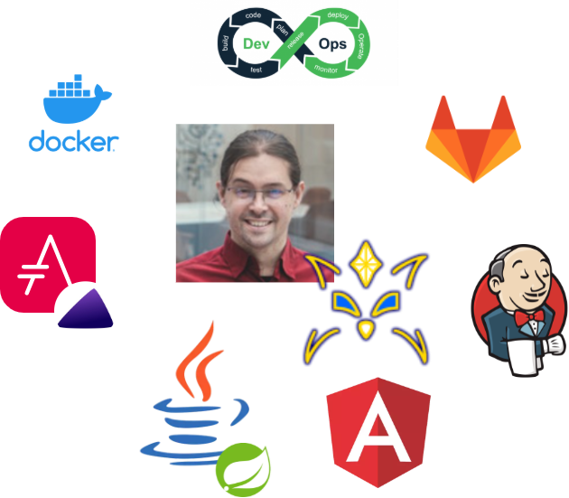

[.basics.background, transition="zoom-in slide-out"]
= Nos deux tourtereaux
:includedir: ../partials

[NOTE.speaker]
====
**Yann [1 min] **:
include::{includedir}/story.adoc[tag=tourtereaux]
====

[.ci.background]
== CI

[NOTE.speaker]
====
Yann :
include::{includedir}/story.adoc[tag=ci-start]
====

[.ci.background, transition="slide-in fade-out"]
== Continuous Build

image::../images/cicd-cicd.build.png[]

[NOTE.speaker]
====
Yann :
include::{includedir}/story.adoc[tag=ci-build]
====

[.ci.background, transition="fade-in slide-out"]
== Continuous Integration

image::../images/cicd-cicd.integration.png[]

[NOTE.speaker]
====
Yann :
include::{includedir}/story.adoc[tag=ci-integration]
====

[.ci.background]
== Bref...
image::../images/geek-evolution.png[]

[NOTE.speaker]
====
Yann :
include::{includedir}/story.adoc[tag=ci-end]
====

[.cd.background]
== CD

[NOTE.speaker]
====
Nico :
include::{includedir}/story.adoc[tag=cd-start]
====

[.cd.background, transition="slide-in none-out"]
== Delivery

image::../images/cicd-cicd.delivery.png[]

[NOTE.speaker]
====
Nico :
include::{includedir}/story.adoc[tag=cd-delivery]
====

[.cd.background, transition=none]
== Deployment

image::../images/cicd-cicd.deployment.png[]

[NOTE.speaker]
====
Nico :
include::{includedir}/story.adoc[tag=cd-deployment]
====

[.cd.background, transition=none]
== Development

image::../images/cicd-cicd.development.png[]

[NOTE.speaker]
====
Nico :
include::{includedir}/story.adoc[tag=cd-development]
====

[.cd.background]
== Bref...
image::../images/geek-evolution.png[]
[NOTE.speaker]
====
Nico :
include::{includedir}/story.adoc[tag=cd-end]
====

[.ci-cd.background, transition="slide-in none-out"]
== La rencontre...

image::../images/cicd-cicd-split.png[]

[NOTE.speaker]
====
Yann :
include::{includedir}/story.adoc[tag=rencontre-start]
====

[.ci-cd.background, transition=none]
== Un avenir tout tracé !

image::../images/cicd-cicd.png[]

[NOTE.speaker]
====
Nico :
include::{includedir}/story.adoc[tag=rencontre-ensemble]
====

[.basics.background]
== Yann

image::../images/intervenants-yann.png[]

[NOTE.speaker]
====
Nico :
include::{includedir}/story.adoc[tag=yann]
====

[.basics.background]
== Nicolas

[NOTE.speaker]
====
Yann :
include::{includedir}/story.adoc[tag=nico]
====

[.transition.background, transition="slide-in zoom-out"]
== !

[NOTE.speaker]
====
Yann :
include::{includedir}/story.adoc[tag=rencontre-end]

====
