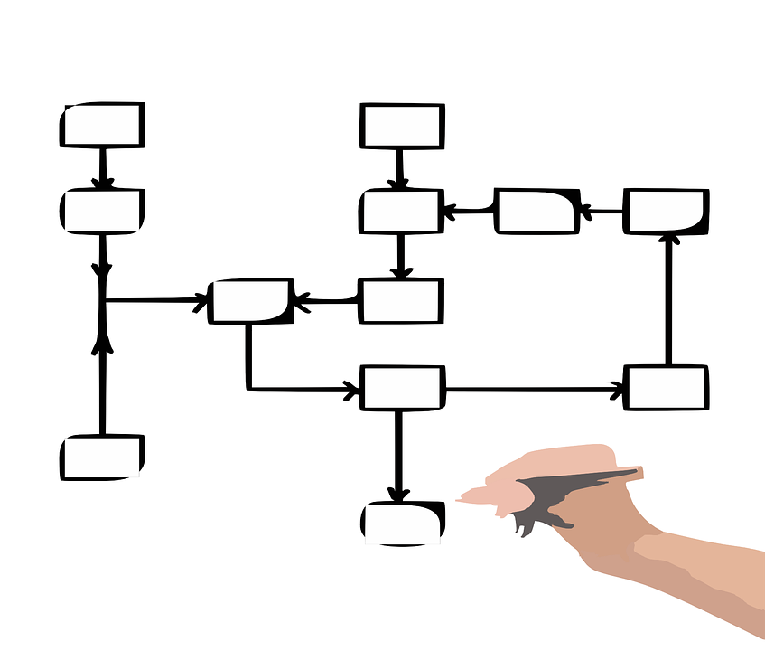

= Ils vécurent heureux, et ...

[NOTE.speaker]
====
Eurent beaucoup de pipelines...

Et un tas de question d'éducation se sont posées...

(HDD : Hype Driven Development :D)

On va sortir un peu de notre fable, mais ce point nous parait essentiel...
====

== Une méthode plus que des outils

* Pipeline == implémentation d'un process de CI/CD
* Pipeline != script

== La définition d'un pipeline

[NOTE.speaker]
====
(HDD : Hype Driven Development :D)
On va sortir un peu de notre fable, mais ce point nous parait essentiel...

C'est un ensemble de taches qui se succèdent pour donner un résultat !
Si on se positionne coté métier, on appelle ca des workflows.
Et si vous êtes vieux, vous avez peut être même appelé ca des grafcets !!!!!
====

== C'est un dessin...

[NOTE.speaker]
====
A cette étape là, même si on en reve, on ne parle pas :

* automatisation
* outils
* etc...
====

== L'excuse...

image::../images/flowchart-complex.jpg[]

[NOTE.speaker]
====
Si vous en êtes là, vous avez un problème, et déjà des solutions !
====

== Pas simple => pas clair !

Ce que l’on conçoit bien s’énonce clairement, Et les mots pour le dire arrivent aisément

[.ref]
Nicolas Boileau

[NOTE.speaker]
====
Et on peut l'adapter aux schémas !!!!!

Parce que si vous n'avrivez pas à le représenter, il va être très difficile de l'appréhender.
====

== Sepatation of concerns

TODO insérer un autre diagramme

image::../images/flowchart-complex.jpg[]

[NOTE.speaker]
====
Voici notre premier concepte de dev applicable à nos pipelines !
====

[.tips]
== Définir les objectifs et contraintes de chaîne

* Besoin spécifique en perf/sécurité/qualité/accessibilité, etc ?
* Build complexe ? Multi plateforme ?
* Règles de l'entreprise à respecter (nommage, peu importe en fait)
* Qui doit voir quoi ? quand ? et surtout comment ?

[NOTE.speaker]
====
Typiquement, on ne va pas attendre la même chose de la CI sur du Web que d'une appli lourde pour des drones.
====

[.tips]
== Analyser les process de dev/déploiement existant

* Normalisation du process de dev
* Ne pas "révolutionner" le process de dev
* C'est un outil qui doit aider et non pas être une contrainte

[NOTE.speaker]
====
On va chercher une adhésion des utilisateurs, sinon c'est inutile ou ce sera mal vécu
====

[.tips]
==  Déterminer mes étapes clés ou cas particuliers

* On déploie tous les mois
* On a une équipe dédiée à vérifier que les titres sont en rouge
* Il n'y a que le lead qui peut builder l'application
* Les clés d'accès aux plateformes sont détenus par le chef uniquement

[.tips]
== Avoir des feedbacks à différents niveaux

* Niveau de précision (un indicateur/la totale)
* Rapidité des retours ?
* Facilité d'accès (page web, envoie de mail, fichier, mail, etc.)
* Intégration dans un système existant ?

== Ca ne vous rappel rien ?

[NOTE.speaker]
====
On ne vous dit pas que XP est fait pour les pipelines,
mais si on peut garder ça à l'esprit, Est ce qu'on se simplifierait pas la vie ?
====

[.transition]
== !

[NOTE.speaker]
====
Regardons les points forts des deux parents...
====
